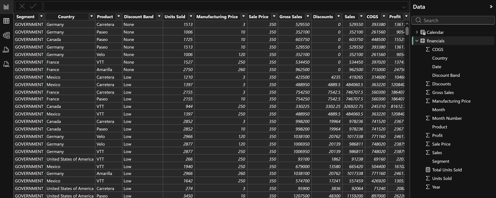

# Power BI Test Dashboard

This dashboard was created while testing Power BI installation. 

## Dataset: 

Source: Power BI sample dataset as listed in the [create a report](https://learn.microsoft.com/en-us/power-bi/create-reports/desktop-excel-stunning-report) tutorial.

`financials` dataset loaded:

Columns: Segment, Country, Product, Discount Band, Units Sold, Manufacturing Price, etc.

Rows: visible in Data view.

## Tools:

- Power BI Desktop

- Excel data file

## Dashboard Preview

## Notes/Observations

- Sample data successfully loaded into Power BI.

- Name of dataset can be seen in right pane.

## File Contents

- `dashboard.pbix` - Power BI dashboard file

- `screenshots/data_loaded.PNG` - preview of the loaded data